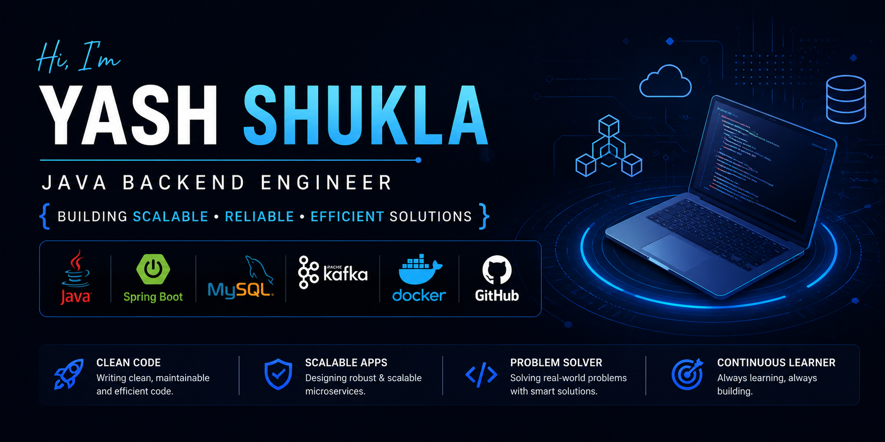

  

# Hi 👋, I'm Yash Shukla

### Software Engineer | Java Developer | Spring Boot | Microservices

💻 Currently working at Nucleus Software Exports Ltd.

🚀 Building:

* Stock Tracker Microservices Application
* Distributed Systems Projects
* Full Stack Applications

📫 Reach me at:

* LinkedIn: linkedin.com/in/yash-shukla-5b65a220a
* Email: vatmat24@gmail.com

---

### Tech Stack

---

### GitHub Stats

---

### Current Goals for 2026

* Crack 15+ LPA Java Developer Role
* Master System Design
* Build Production-grade Microservices
* Learn Kubernetes
* Become Strong in DSA (Java)
